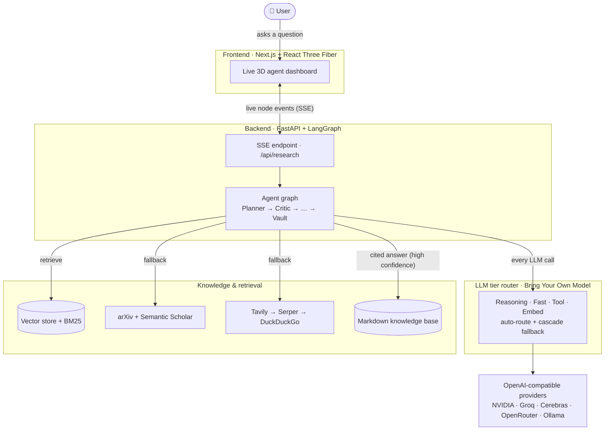
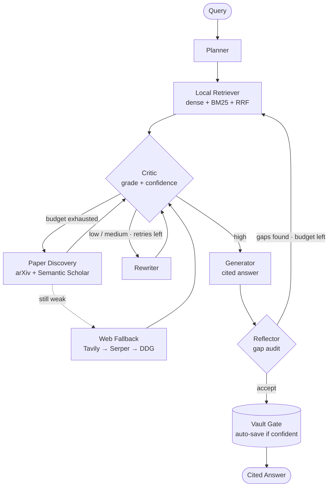

# 🌌 ResearGent

**A hallucination-resistant, multi-agent research engine with a live 3D dashboard.**

[](https://opensource.org/licenses/MIT)
[](https://langchain-ai.github.io/langgraph/)
[](https://docs.pmnd.rs/react-three-fiber)
[](#-bring-your-own-model-byom)

ResearGent answers research questions by **grounding every claim in evidence it can cite** — and refusing to bluff when it can't. Instead of trusting a single vector-search pass, it runs an adversarial **Corrective-RAG + self-reflection** loop: a Critic grades the retrieved context, a Rewriter retries weak queries, and when local knowledge runs out the agent **cascades to academic APIs (arXiv / Semantic Scholar) and live web search** before writing a cited answer. High-confidence results are auto-saved to a local Markdown knowledge base that grows over time.

The whole agent graph streams to a **Next.js + React Three Fiber dashboard** that visualizes the pipeline in real time over Server-Sent Events.

> <!-- Add a screenshot or GIF of the 3D dashboard here, e.g. docs/demo.gif -->
> *(Run `researgent serve` + the frontend to see the live 3D agent network.)*

---

## ⚡ Why ResearGent

- **It proves before it answers.** A strict Critic node grades retrieved chunks (relevant / partial / irrelevant) and assigns a confidence score. Weak evidence triggers correction, not confident-sounding fabrication.
- **It cascades instead of giving up.** Local retrieval → query rewriting → academic paper discovery (arXiv + Semantic Scholar, full-text PDF parsing) → live web fallback → last-resort priors. Each stage only fires when the previous one falls short.
- **It self-reflects.** After drafting, a Reflector node looks for gaps and can loop back for another targeted retrieval pass within a bounded budget.
- **It only saves what it trusts.** Answers that clear a configurable confidence gate are written back to your notes folder as cited Markdown. Pure-guess answers (no sources) are never saved.
- **It's model-agnostic.** Every LLM call is routed by *capability tier*, so you bring your own provider and decide which model does the heavy thinking vs. the fast inner-loop work. See [BYOM](#-bring-your-own-model-byom).
- **It's observable.** A cinematic 3D dashboard shows each node activating, data flowing along edges, and the final cited answer — all live.

---

## 🏗️ Architecture

A browser dashboard talks to a FastAPI backend over Server-Sent Events. The backend runs the LangGraph agent, which routes every LLM call through a capability-tier router (your models) and pulls evidence from local retrieval, academic APIs, and the web — saving trusted answers back to your knowledge base.



---

## 🧠 How it works

The agent is a state machine: retrieve, **grade**, and only ship when the evidence holds up — otherwise correct course (rewrite → papers → web) before answering.



**The nodes:**

1. **Planner** — decomposes complex queries into structured, atomic sub-questions.
2. **Local Retriever** — hybrid retrieval (dense vectors + BM25, fused with Reciprocal Rank Fusion) over your ingested corpus, with optional knowledge-graph expansion along note links.
3. **The Critic** — grades retrieved context and assigns a confidence verdict (`high` / `medium` / `low`). The gatekeeper that decides whether to ship or correct.
4. **Rewriter** — re-engineers the query to bridge semantic gaps, then re-retrieves (bounded retry budget).
5. **Paper Discovery** — when local evidence is insufficient, searches arXiv + Semantic Scholar and parses open-access PDFs on the fly.
6. **Web Fallback** — live web search (Tavily → Serper → DuckDuckGo cascade) as a resilient last external resort.
7. **Generator** — synthesizes a single answer with inline `[S#]` citations tied to the evidence.
8. **Reflector** — audits the draft for gaps and can trigger one more retrieval loop.
9. **Vault Gate** — writes high-confidence, cited answers to your local Markdown knowledge base.

> The retrieval cascade is **corrective**: each fallback stage only runs when the Critic isn't satisfied, so cheap local answers stay cheap and only hard questions pay for paper/web lookups.

---

## 🔌 Bring Your Own Model (BYOM)

ResearGent never hardcodes a model. Every LLM call is tagged with a **capability tier**, and you map each tier to whatever provider/model you prefer. This lets you put a strong model where reasoning matters and a cheap, fast model in the tight inner loops.

| Tier | Used by | What it needs |
|------|---------|---------------|
| **Reasoning** | Planner, Generator, Reflector | Strong synthesis & decomposition. Put your best model here. |
| **Fast** | Critic, Rewriter | Ultra-low latency / high rate limits — these run many times per query. A small, cheap model is ideal. |
| **Tool** | Tool / function-calling paths | A model that's reliable at structured output. |
| **Embed** | Ingestion & retrieval | An embedding model. Required for local retrieval. |

**Supported provider slots** — all speak the OpenAI-compatible API, so anything that exposes one works:

- **NVIDIA NIM**, **Groq**, **Cerebras** — fast hosted inference
- **OpenRouter** — one key, many model families (a convenient universal gateway)
- **Ollama** — fully local / offline (also covers vLLM, LM Studio, or any local OpenAI-compatible server via its base-URL override)

Each provider slot exposes a **base URL** and **per-tier model** override, so you can point a slot at *any* OpenAI-compatible endpoint and choose exactly which model serves each tier.

**Routing & resilience:**
- By default the system auto-detects which providers you've configured and routes each tier to the best available one.
- You can pin a tier to a specific provider (e.g. `REASONING_PROVIDER=...`, `FAST_PROVIDER=...`).
- **Cascade fallback** is built in: on a transient failure (rate limit / 5xx / timeout) a tier automatically rolls to the next configured provider, so one provider hiccup doesn't kill a run.

Check exactly how your config resolves at any time:

```bash
researgent status     # shows configured providers, per-tier routing, and cascade chains
researgent smoke      # pings each chat tier with one prompt to confirm credentials
researgent doctor     # verifies the embedding tier (and Ollama, if used) is reachable
```

---

## 🚀 Getting Started

### Prerequisites

- **Python 3.11 or 3.12**
- **Node.js 18.17+** (for the 3D dashboard)
- **[uv](https://github.com/astral-sh/uv)** — fast Python package manager
- An **embedding model**. The simplest free/local option is [Ollama](https://ollama.com) with an embedding model pulled (`ollama pull nomic-embed-text`); or use a hosted embed-capable provider.
- *(Optional)* API keys for whichever LLM provider(s) and web-search providers you want to use.

### 1. Clone & install the backend

```bash
git clone https://github.com/SaumyaBish-t/ResearGent.git
cd ResearGent

# Create the venv and install everything from the lockfile
uv sync
```

> All backend commands below can be run as `uv run researgent <command>`, or activate the venv first
> (`source .venv/bin/activate`, or `.venv\Scripts\activate` on Windows) and just call `researgent <command>`.

### 2. Configure your models (`.env`)

Create a `.env` file in the project root. **You choose the provider and the model for each tier** — set the API key for at least one provider and (optionally) override the per-tier models. A copyable starting point:

```dotenv
# ── Pick at least one LLM provider and set its key ────────────────────────────
# ResearGent auto-routes tiers across whatever you configure, with cascade
# fallback on rate limits. Set the keys for whatever you want to use.

# Hosted gateway (one key, many model families) — a convenient default:
OPENROUTER_API_KEY=
# Other built-in slots (each optional):
# NVIDIA_API_KEY=
# GROQ_API_KEY=
# CEREBRAS_API_KEY=

# ── Choose which model serves each capability tier ───────────────────────────
# Use whatever model strings your provider offers. Put a strong model on
# REASONING and a fast/cheap one on FAST.  (Vars are <PROVIDER>_MODEL_<TIER>.)
OPENROUTER_MODEL_REASONING=<your strong reasoning model>
OPENROUTER_MODEL_FAST=<your fast, low-latency model>
OPENROUTER_MODEL_TOOL=<your tool / function-calling model>

# Optionally pin which provider handles a tier (otherwise auto-detected):
# REASONING_PROVIDER=openrouter
# FAST_PROVIDER=groq

# ── Embeddings (required for local retrieval) ────────────────────────────────
# Use an embed-capable provider: ollama (local), nvidia, or openrouter.
EMBED_PROVIDER=ollama
# OLLAMA_BASE_URL=http://localhost:11434/v1
# OLLAMA_MODEL_EMBED=<your embedding model>

# ── Optional: external fallbacks ─────────────────────────────────────────────
TAVILY_API_KEY=               # live web search (optional; falls back to DuckDuckGo)
SEMANTIC_SCHOLAR_API_KEY=     # optional — higher Semantic Scholar rate limits

# ── Knowledge base + behavior ────────────────────────────────────────────────
NOTES_FOLDER_PATH=./notes         # where cited answers are auto-saved (any Markdown folder)
AUTO_SAVE_MIN_CONFIDENCE=medium   # high | medium | low | always

# ── Frontend ─────────────────────────────────────────────────────────────────
# The default already allows the Next.js dev server; override if you change ports.
# CORS_ALLOW_ORIGINS=http://localhost:3000
```

> **Want a fully local, no-API-key setup?** Configure only the Ollama slot (reasoning / fast / tool / embed models) and set `PRIMARY_PROVIDER=ollama`. Everything runs offline.

Verify your wiring before ingesting anything:

```bash
uv run researgent status     # confirm routing looks right
uv run researgent doctor     # confirm embeddings work
```

### 3. Add a knowledge base

ResearGent answers from a corpus you give it. Ingest any of:

```bash
# Ingest a PDF or a folder of PDFs
uv run researgent ingest ./path/to/papers/

# Ingest a folder of Markdown notes (Obsidian-style [[wikilinks]] become graph edges)
uv run researgent vault-ingest ./path/to/notes/

# Or seed a topic straight from Semantic Scholar abstracts
uv run researgent seed "your research topic"
```

(No corpus yet? The agent will still cascade to paper discovery and web search.)

### 4. Run the backend

```bash
uv run researgent serve            # http://localhost:8000  (API + a built-in lightweight UI)
# API docs at:                     # http://localhost:8000/docs
```

You can also run a research query straight from the CLI, no frontend needed:

```bash
uv run researgent research "How does the ReAct framework combine reasoning and acting in LLM agents?"
```

### 5. Run the 3D dashboard (frontend)

In a second terminal:

```bash
cd frontend
cp .env.local.example .env.local   # points NEXT_PUBLIC_API_BASE at http://localhost:8000
npm install
npm run dev                        # http://localhost:3000
```

Open **http://localhost:3000**, type a question, and watch the agent network light up node-by-node, fire data particles along its edges, and present the final cited answer.

---

## 🗂️ Configuration reference

| Variable | Purpose |
|----------|---------|
| `OPENROUTER_API_KEY` / `NVIDIA_API_KEY` / `GROQ_API_KEY` / `CEREBRAS_API_KEY` | Enable a provider by setting its key. |
| `<PROVIDER>_MODEL_REASONING` / `_FAST` / `_TOOL` / `_EMBED` | The model that provider uses for each tier. |
| `<PROVIDER>_BASE_URL` | Point a provider slot at any OpenAI-compatible endpoint. |
| `PRIMARY_PROVIDER` | Force one provider for **all** tiers. |
| `REASONING_PROVIDER` / `FAST_PROVIDER` / `TOOL_PROVIDER` / `EMBED_PROVIDER` | Pin a single tier to a provider. |
| `FAST_CASCADE` / `REASONING_CASCADE` / `TOOL_CASCADE` | Comma-separated custom fallback order for a tier. |
| `TAVILY_API_KEY` / `SERPER_API_KEY` | Web-search providers (DuckDuckGo is the keyless final fallback). |
| `SEMANTIC_SCHOLAR_API_KEY` | Optional — higher rate limits for paper discovery. |
| `NOTES_FOLDER_PATH` | Folder where cited answers are auto-saved (plain `.md`). |
| `AUTO_SAVE_MIN_CONFIDENCE` | `high` / `medium` / `low` / `always` gate for auto-saving. |
| `CORS_ALLOW_ORIGINS` | Origins allowed to call the API from a browser. |
| `DATABASE_URL` | *(Optional)* Postgres for durable LangGraph checkpointing; in-memory if unset. |

Run `researgent status` for a live view of how these resolve.

---

## 📁 Project structure

```
ResearGent/
├── src/                     # Python backend
│   ├── agent/               # LangGraph state machine (nodes, graph, streaming)
│   ├── api/                 # FastAPI app + SSE endpoint
│   ├── llm/                 # Provider-agnostic LLM routing + cascade
│   ├── retrieval/           # Hybrid retrieval, paper discovery, web fallback
│   ├── ingest/              # PDF / Markdown chunking + embedding pipeline
│   └── main.py              # `researgent` CLI
├── frontend/                # Next.js + React Three Fiber 3D dashboard
│   ├── app/                 # routes + global styles
│   ├── components/          # Scene, AgentNode, Edges, Overlay, SearchBar, ...
│   └── lib/                 # Zustand store (SSE bridge), graph config, types
├── data/                    # Vector store + ingested corpora (gitignored)
├── notes/                   # Default knowledge-base output folder
├── pyproject.toml           # Backend deps (managed by uv)
└── .env                     # Your configuration (create this)
```

---

## 🛠️ Useful commands

```bash
researgent status              # provider routing + cascade chains
researgent smoke               # ping each LLM tier (credential check)
researgent doctor              # embedding / Ollama health check
researgent ingest <path>       # ingest PDF(s)
researgent vault-ingest <dir>  # ingest a Markdown notes folder
researgent research "<query>"  # full agentic run in the terminal
researgent serve               # launch the API + SSE stream
researgent store info          # inspect the vector store
```

---

## 🤝 Contributing

Contributions are welcome. Good first areas:

- Additional academic providers (OpenAlex, PubMed, CORE)
- Smarter chunking heuristics for dense PDFs
- A paper-aware Critic rubric (grading full-text PDF chunks vs. clean web prose)
- Frontend polish and accessibility

Please open an issue to discuss larger changes, then submit a PR.

---

## 📄 License

MIT — see [`LICENSE`](LICENSE).
